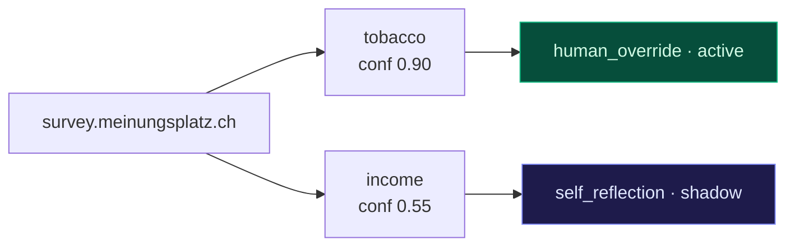
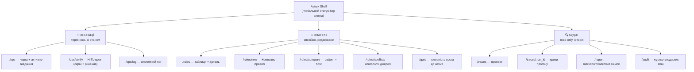

# План-додаток: Astryx React UI + експорт/редагування `host_rules`

> [!NOTE]
> ✅ **СТАТУС: 100% РЕАЛІЗОВАНО (Фази U0–U6)**  
> Усі фази консолі Astryx React UI (Фази U0-U6) реалізовано у фічах `004-astryx-ui-console`, `005-tutor-live-activity`, `006-tutor-interactive-loop` та `008-fallback-browser-sources`.
>
> Основний план-файл цим документом **не змінюється**. Нумерація фаз тут
> навмисно окрема (`U0…U6`), щоб не колідувати з фазами 1–8.

---

## 0. Контекст і межі

Поточний стан, від якого відштовхуємось (перевірено в коді, не з пам'яті):

| Компонент | Стан |
|-----------|------|
| `persona_graph_memory.py` | `host_rules` (UNIQUE `host,persona,pattern,source`), `run_traces` (prune до 40/хост), `record_host_rule` (UPSERT + автобамп confidence `+0.15`, cap `0.95`), `get_host_rules` (precedence host > base_domain > `*`, persona > `*`, source_rank `human_override < seed < self_reflection`, дедуп по `pattern`), `bump_rule_outcome` (promote shadow→active лише якщо `os.environ["VYDRA_PLAYBOOK"] == "active"`; retire при `losses>=3 and losses>wins`) |
| `reflection.py` | `TOPIC_KEYWORDS` (10 патернів), `QUALIFYING_POLARITY`, `classify_outcome`, `reflect()` → shadow-правила |
| `astryx_survey_server.py` | Flask :5005, один великий `ASTRYX_HTML_TEMPLATE` через `render_template_string` на `/`, Tailwind з CDN, polling `fetchStatus` 800 мс + скріншот 1200 мс, HITL-цикл `verify_step` (блокує агента до 300 с) / `approve_step` / `override_step` |
| `survey_agent.py` | пише trace + shadow-правила після degraded-прогону; поважає `human_override` (не перезаписує патерн) |
| Продакшн-хост | телефон OnePlus 13 / Termux, RAM ділиться з `llama-server` + vision; README прямо декларує «без Node/MCP-залежностей на телефоні» |
| Публікація | `https://kindle.exodus.pp.ua/survey` (реверс-проксі на підшлях!) + локально `http://192.168.3.196:5005` |

Що цей додаток **не** робить: не змінює логіку народження правил, не чіпає
`reflect()`, не змінює те, як правила потрапляють у промпт персони (це фаза 6
основного плану).

### Три дефекти, знайдені під час планування (враховані нижче)

1. **`record_host_rule` не годиться для редагування людиною.** Кожен виклик
   робить `confidence = MIN(0.95, confidence + 0.15)`. Якщо UI зберігатиме
   відредагований `behavior` через нього — confidence поповзе вгору при
   кожному натисканні «Зберегти». Потрібна окрема функція запису
   (`update_host_rule`), яка пише рівно те, що дала людина.
2. **Правило не має посилання на прогін.** `reflect()` кладе в `evidence`
   `outcome_reason/step/question/answered/outcome`, але **не** `run_id`, а
   `survey_agent.py` його туди не додає. Тому click-through «правило → trace»
   зараз неможливий за ключем. Рішення: додати `run_id` в `evidence` для нових
   правил (одна фаза), а для наявних — резервний пошук по
   `host` + вікно часу (`rule.created_at` між `trace.started_at` і
   `trace.ended_at + 60s`), з явною позначкою «зв'язок евристичний».
3. **SQLite без WAL/busy_timeout.** `_connect()` відкриває БД у режимі за
   замовчуванням. Зараз писар практично один (агент). Після появи UI людина
   робитиме bulk-запис одночасно з прогоном → `database is locked`. Потрібні
   `PRAGMA journal_mode=WAL` + `PRAGMA busy_timeout=5000`.

---

## 1. Markdown/Mermaid експорт стану `host_rules`

**Мета:** читабельний знімок стану для аудиту/дебагу без вебу — те, що можна
подивитись у Termux через `less`, вкласти в HANDOFF або дифнути між днями.

### Новий модуль: `rules_report.py` (корінь репо, лише stdlib + `sqlite3`)

Свідомо **окремий файл, а не розширення CLI `persona_graph_memory.py`**: щоб
фаза U0 не торкалася жодного файлу, який виконується під час живого прогону.

```
Публічний інтерфейс (сигнатури — план, не код):

  collect(hosts=None, personas=None, statuses=None, include_retired=True) -> dict
      Читає host_rules + run_traces read-only (одне з'єднання, mode=ro URI).
      Повертає нормалізовану структуру, згруповану host -> persona -> status.

  render_markdown(data, *, with_evidence=False, with_mermaid=True,
                  max_mermaid_nodes=40) -> str
  render_mermaid(data, host) -> str
  render_stats(data) -> str        # accept-rate таблиця (див. §3)
```

### Структура звіту

```markdown
# host_rules snapshot — 2026-08-08T19:40:12Z
DB: ~/.vydra-survey-profiles/survey_graph.db · правил: 37 (active 12 / shadow 21 / retired 4)

## Зведення по хостах
| host | persona | active | shadow | retired | сер. confidence | останнє оновлення |

## survey.meinungsplatz.ch
### ✅ active
| pattern | source | conf | hits/wins/losses | behavior (120 симв.) | оновлено |
### 🕓 shadow  (чекає на людський гейт)
### 🗄 retired

## Конфлікти (той самий pattern, різні source, різний behavior)
## Розбіжності між хостами (той самий pattern, різна поведінка)
```

Правила рендеру:

- **Детермінований порядок** (host → persona → status → pattern) — щоб
  `git diff` двох знімків був змістовним.
- `behavior` обрізається до 120 символів у таблиці; повний текст —
  у `<details>` під таблицею.
- **`evidence` за замовчуванням НЕ друкується.** Воно містить
  `page_text[:300]` і людські override-цілі — це реальні відповіді реальних
  людей. Тільки `--with-evidence`, і директорія звітів іде в `.gitignore`
  (README: «PII ніколи не потрапляє в цей репозиторій»).
- Порожній стан («правил немає») — валідний вивід, не помилка.

### Mermaid



Один граф **на хост**, не один глобальний — глобальний нечитабельний уже на
десятках правил. Ліміт `--max-mermaid-nodes` (дефолт 40, беруться найвищі за
confidence), решта — рядком «+N правил не показано».

### CLI

```bash
python3 rules_report.py                                  # всі хости, stdout
python3 rules_report.py --host survey.meinungsplatz.ch
python3 rules_report.py --persona arno --status shadow
python3 rules_report.py --out docs/reports/host_rules-$(date +%F).md
python3 rules_report.py --stats                          # лише accept-rate
python3 rules_report.py --with-evidence --out /tmp/audit.md   # локально, не в git
```

Той самий рендер перевикористовується вебом (`GET /api/rules/report.md`) —
одна реалізація, два споживачі.

**Файли:** `rules_report.py` (new), `docs/reports/.gitignore` (new),
`.gitignore` (+1 рядок).

---

## 2. Людський UI перегляду/редагування `host_rules`

### 2.1 Backend: `rules_api.py` (Flask Blueprint)

Новий файл, реєструється в `astryx_survey_server.py` двома рядками
(`from rules_api import rules_bp` + `app.register_blueprint(rules_bp)`) — це
єдина зміна існуючого сервера у фазах U0–U3.

**Read-only (фаза U1):**

| Метод | Шлях | Призначення |
|-------|------|-------------|
| GET | `/api/rules` | `host[]`, `persona[]`, `status[]`, `source[]`, `q` (LIKE по pattern+behavior), `sort=confidence\|updated_at\|wins`, `order`, `limit/offset`. Повертає **сирі** рядки + прапорець `effective` (чи виграє це правило дедуп у `get_host_rules`) + `shadowed_by` (id того, що виграло) |
| GET | `/api/rules/facets` | Списки хостів/персон/джерел із лічильниками по статусу — для фільтр-рейки й мультивибору |
| GET | `/api/rules/<id>` | Повний рядок + розпарсене `evidence` + `linked_traces[]` |
| GET | `/api/rules/compare?pattern=income` | Той самий pattern по всіх хостах/персонах — виявлення розбіжностей |
| GET | `/api/rules/conflicts` | Групи `(host, persona, pattern)`, де ≥2 рядків з різним `source` і різним `behavior` |
| GET | `/api/rules/vocabulary` | Ключі `reflection.TOPIC_KEYWORDS` + `QUALIFYING_POLARITY` — контрольований словник патернів (див. §3) |
| GET | `/api/rules/report.md` | Той самий рендер, що й CLI (`text/markdown`) |
| GET | `/api/traces` | `host`, `persona`, `outcome`, `limit` — журнал прогонів |
| GET | `/api/traces/<run_id>` | Кроки прогону (`steps_json`), фінальний текст, outcome |
| GET | `/api/gate/<host>` | Готовність хоста до `VYDRA_PLAYBOOK=active`: скільки shadow не переглянуто, скільки конфліктів, скільки правил без evidence |

**Мутації (фаза U3):**

| Метод | Шлях | Призначення |
|-------|------|-------------|
| PATCH | `/api/rules/<id>` | `{behavior?, confidence?, status?}` → `update_host_rule()`. Валідація: `status ∈ {shadow,active,retired}`, `confidence` кламп `[0.0,1.0]`, `behavior` ≤ 2000 симв., порожній `behavior` заборонено |
| POST | `/api/rules` | Ручне проактивне створення (use-case «до першого прогону»): `{host, persona, pattern, behavior, confidence, status}`, `source='human_override'` завжди |
| POST | `/api/rules/bulk` | `{ids[], op: promote\|retire\|delete, note}` — одна транзакція, часткові збої не залишають напів-стан |
| POST | `/api/rules/<id>/resolve_conflict` | `{winner_id, loser_action: retire\|delete, note}` — явне рішення по конфлікту `human_override` vs `self_reflection` |
| POST | `/api/gate/<host>/approve` | Bulk-approve всіх переглянутих shadow + перемикання `host_gates.playbook_mode` (див. 2.3) |

**Безпека (обов'язково у складі U3, не «потім»):** сервер слухає `0.0.0.0:5005`
і виставлений назовні через `kindle.exodus.pp.ua/survey` **без будь-якої
автентифікації сьогодні**. Нові ендпоїнти додають руйнівні операції (bulk
retire/delete). Мінімум: спільний секрет `ASTRYX_API_TOKEN` з env, заголовок
`X-Astryx-Token` на **всіх** мутуючих `/api/rules*` і `/api/gate*`; без токена в
env — мутуючі маршрути повертають 503 і не реєструються. Це не замінює
нормальну автентифікацію всього UI, але закриває найгірший сценарій.

### 2.2 Доповнення `persona_graph_memory.py` (адитивні)

Нові функції — жодна існуюча не переписується:

```
update_host_rule(rule_id, *, behavior=None, confidence=None,
                 status=None, actor="human") -> dict
    Пише рівно передані поля + updated_at. НЕ бампає confidence.
    Пише рядок у rule_audit до й після.

create_manual_rule(host, pattern, behavior, *, persona, confidence,
                   status, actor) -> int
    Обгортка над record_host_rule для випадку «правила ще не існує»,
    але з явною перевіркою: якщо рядок уже є — повертає конфлікт,
    а не мовчазний бамп confidence.

bulk_set_status(rule_ids, status, *, actor, note) -> int
list_rules_raw(**filters) -> list[dict]        # без дедупу/precedence
list_traces(**filters) -> list[dict]
get_trace(run_id) -> dict | None
record_rule_audit(rule_id, action, before, after, actor, note) -> None
```

Нові таблиці у `SCHEMA` (обидві `CREATE TABLE IF NOT EXISTS`, тому міграція
відбувається сама при першому `_connect()`):

```sql
CREATE TABLE IF NOT EXISTS rule_audit (
    id INTEGER PRIMARY KEY AUTOINCREMENT,
    rule_id INTEGER NOT NULL,
    actor TEXT NOT NULL,          -- 'human:<нік>' | 'agent'
    action TEXT NOT NULL,         -- edit|promote|retire|delete|create|resolve_conflict
    before_json TEXT, after_json TEXT, note TEXT,
    created_at TEXT NOT NULL
);
CREATE TABLE IF NOT EXISTS host_gates (
    host TEXT PRIMARY KEY,
    playbook_mode TEXT NOT NULL DEFAULT 'shadow',   -- shadow|active
    approved_by TEXT, approved_at TEXT, note TEXT
);
```

Плюс у `_connect()`: `PRAGMA journal_mode=WAL` і `PRAGMA busy_timeout=5000`
(дефект №3). Це єдина зміна гарячого шляху в цьому додатку — окрема фаза,
окремий відкат.

### 2.3 Рольовий гейт ризику (Phase 7 основного плану)

Сьогодні `bump_rule_outcome` дивиться на **глобальну** змінну середовища
`VYDRA_PLAYBOOK`, тобто «увімкнути playbook для одного хоста» неможливо.

- **Варіант A (мінімальний):** сервер передає `VYDRA_PLAYBOOK=active` у env
  підпроцесу в `run_survey_execution`. Нуль змін у гарячому шляху, але гейт
  глобальний — увімкнув для перевіреного хоста, увімкнув і для нового.
- **Варіант B (рекомендований):** таблиця `host_gates` + у `bump_rule_outcome`
  умова стає «env == active **АБО** `host_gates[host].playbook_mode == 'active'`».
  Це рівно та гранулярність, яку описує use-case («перемикання **хоста** на
  active»), і саме її показує екран гейта.

**Рекомендація: B**, у окремій фазі U4, бо це єдина зміна поведінки навчання.
Env-змінна лишається як глобальний kill-switch/перекриття.

Екран гейта показує чек-лист і **не дає** натиснути «Перемкнути хост на
active», доки: усі shadow-правила хоста переглянуті людиною (`rule_audit` має
запис по кожному), конфліктів `0`, і є ≥1 завершений прогін з
`outcome='completed'` на цьому хості.

### 2.4 Покриття зібраних use-case'ів

| # | Use-case | Де вирішується |
|---|----------|----------------|
| 1 | Фільтр host+persona+status, сортування по confidence | `/rules`, фільтр-рейка + таблиця; `GET /api/rules` |
| 2 | Редагування `behavior`/`confidence`, promote/retire вручну | Детальна панель; `PATCH /api/rules/<id>` через `update_host_rule` (без автобампу) |
| 3 | Bulk-approve shadow як гейт перед `active` | Екран `/gate/<host>`; `POST /api/rules/bulk` + `POST /api/gate/<host>/approve` |
| 4 | Click-through правило → `run_traces` (evidence) | Детальна панель, секція «Докази»; `linked_traces` (по `run_id` для нових правил, евристика за часом — для старих; якщо trace вирізано prune-логікою 40/хост → плашка «прогін уже видалено, лишились лише поля evidence») |
| 5 | Порівняння того самого pattern між хостами | Екран «Порівняння»: pivot pattern × host, клітинка = `status/conf/source` |
| 6 | Ручне проактивне створення правила до першого прогону | Композер правил (§3), `POST /api/rules`, `host` вводиться вручну, включно з `*` і base-domain |
| 7 | Конфлікт `human_override` vs `self_reflection` на одному pattern | Екран «Конфлікти» + `resolve_conflict`. Пояснюємо в UI, що читання вже детерміноване (`source_rank` у `get_host_rules`) — конфлікт це не помилка виконання, а сигнал «self-reflection дізналась щось інше, ніж сказала людина» |
| 8 | Пошук/фільтр по багатьох хостах/персонах одночасно | Мультивибір у фільтрах (`host[]`, `persona[]`) + `q` по тексту; фасети з лічильниками |

---

## 3. DRAKON-подібна авторинг-схема: вердикт

> [!IMPORTANT]
> **Припущення.** Доступу до `maxfraieho/vydra-studio` у цієї сесії немає
> (приватний репо, `gh` не встановлений, локального клону нема). Опис патерну
> нижче реконструйовано з формулювання задачі та із загального устрою
> DRAKON-based rule authoring: діаграма → експорт псевдокоду → строгий
> whitelist-парсер фактів/дієслів проти `docs/fact-vocabulary.md` → декларативний
> `agent_rules.yaml` (правила-як-дані, без `eval`) → людський Approve/Discard →
> `tools/rule_stats.py` з accept-rate. Якщо реальність відрізняється — вердикт
> варто перечитати, але аргумент про масштаб від деталей не залежить.

### Вердикт: адаптувати **принципи**, не round-trip. Повний DRAKON — over-engineering тут.

**Чому повний round-trip не переноситься:**

1. **Немає чого захищати whitelist-парсером.** У Vydra Studio whitelist існує,
   бо псевдокод з діаграми перетворюється на **виконувані** правила — там
   `eval`-подібний ризик реальний. Тут `behavior` — це проза, яку вставляють у
   промпт персони для Gemma. Вона ніколи не виконується. Строгий парсер дієслів
   ловив би клас помилок, якого в цій схемі не існує.
2. **Схема тривіальна.** `pattern` + `behavior` + `confidence` — це форма з
   трьома полями. DRAKON-діаграма виправдана, коли є розгалуження, порядок і
   вкладені умови; тут структури керування немає взагалі.
3. **Масштаб.** Десятки правил, 2 персони, одиниці хостів, один автор. Вартість
   (редактор діаграм + експортер + парсер + словник дієслів + документація) не
   окупається; це ще й Node/canvas-залежність на хості, де ми свідомо тримаємо
   нуль Node у рантаймі.

**Що з патерну переносимо (все — дешеве, все — в плані):**

| Принцип Studio | Реалізація тут |
|----------------|----------------|
| `docs/fact-vocabulary.md` як єдине джерело правди | `docs/pattern-vocabulary.md` — ключі `reflection.TOPIC_KEYWORDS` + `QUALIFYING_POLARITY` як **явний контрольований словник**, віддається через `GET /api/rules/vocabulary`. Сьогодні цей словник існує де-факто, але лише як dict у коді |
| Whitelist замість вільного вводу | `pattern` у формі створення — **`<select>` зі словника**, не текстове поле. Кастомний pattern дозволений, але з жовтою плашкою «не буде розпізнаний `detect_pattern()`, тож правило ніколи не спрацює автоматично» — це найчастіша можлива помилка людини і UI має її ловити |
| Rules-as-data, ніякого eval | Уже виконано (рядки SQLite, `behavior` тільки конкатенується в промпт). Фіксуємо як **інваріант** у `docs/pattern-vocabulary.md`: «`behavior` ніколи не інтерпретується як код; будь-яка майбутня пропозиція виконуваних правил — окремий план з окремим гейтом» |
| Approve/Discard черга | Екран гейта (§2.3): shadow-черга = Approve/Discard |
| `tools/rule_stats.py` accept-rate | Уже є `hits/wins/losses`. `rules_report.py --stats` + панель «Статистика правил»: `win_rate = wins/(wins+losses)`, вік, чи правило взагалі колись матчилось (`hits=0` при непорожньому віці = мертве правило-кандидат на retire) |

**Компроміс, який реально будуємо — «Композер правил»** (замість голої
`<textarea>`):

```
[ pattern ▾ ]  tobacco | health_status | ... | (кастомний ⚠)
[ вид поведінки ▾ ]  affirm | deny | not_fully_healthy | вільний текст
[ хост ]  survey.meinungsplatz.ch | meinungsplatz.ch | *
[ persona ▾ ]  arno | annet | *
[ confidence ]  ▁▂▃▅ 0.90
→ Попередній перегляд (генерується тим самим шаблоном, що й seed-фрази в migrate()):
  «На питання про 'tobacco' завжди відповідай ствердно ('Так'/'Користуюся') — …»
[ уточнити вручну ▾ ]  (розгортає textarea з попереднім переглядом як заготовкою)
```

Той самий дух — явний словник, керований вибір, детермінований текст — за
вечір роботи замість двох тижнів.

**Тригери перегляду вердикту** (записати в план, щоб рішення не «застигло»):
`behavior` стає структурованим/виконуваним (condition→action DSL); правил
> ~200 на >10 хостів; з'являється другий автор правил, який не писав цей код.

---

## 4. React + Astryx: інформаційна архітектура

### 4.1 Ключове архітектурне рішення (підтверджене користувачем)

Flask стає **чистим JSON API**. Жодного нового server-rendered HTML.
Фронтенд — React + `@astryxdesign/core` + тема `@astryxdesign/theme-*` (StyleX).

> [!IMPORTANT]
> **Припущення про API Astryx.** Точний перелік компонентів і назви імпортів у
> цій сесії не верифіковані. Перший крок фази U2 — `astryx init` у `web/` і
> звірка цього розділу з агентським cheat-sheet, який він генерує. Нижче
> компоненти названі за очікуваними ролями (Surface/Card, Table/DataGrid,
> Dialog, Tabs, TextField, Badge, Banner), а не за гарантованими іменами.

### 4.2 ПОТРЕБУЄ SIGN-OFF: build-target

**Рекомендація: build-time-only Node на dev-184 (або будь-якому не-телефонному
хості). Артефакти збірки віддаються тим самим Flask-процесом як статика.
Жодного Node-рантайму на продакшн-телефоні.**

Обґрунтування:

1. **RAM.** На телефоні вже конкурують `llama-server` і vision-модель;
   `survey_agent.py` має власний `heavy_state_busy()`-гейт саме тому, що
   одночасно вміщується **один** важкий режим. Vite dev-server або SSR-Node —
   це +150–400 МБ RSS і другий процес під наглядом, який треба перезапускати.
   `HANDOFF.md` документує реальний інцидент з `load average 15.39` без
   очевидного винуватця — додавати ще один довгоживучий рантайм у цю систему
   означає ускладнювати саме ту діагностику, яка вже була важкою.
2. **Інваріант проєкту.** README прямо декларує «без Node/MCP-залежностей на
   телефоні». `cdp_client.py` написаний на голому CDP саме щоб уникнути Node.
   Ламати це заради UI — найдорожча зміна в усьому додатку.
3. **SSR тут нічого не дає.** SEO не існує (приватна консоль у LAN + один
   реверс-проксі), first-paint для одного оператора не критичний. Єдина реальна
   перевага built-режиму — відсутність flash-of-unstyled — досягається
   `astryx theme build` **на етапі збірки**, без Node у рантаймі.
4. **Бонус: офлайн.** Поточний UI тягне Tailwind з CDN і має аварійний
   `no-tailwind` фолбек. Зібрана тема Astryx — це локальний `theme.css`,
   тобто CDN-залежність зникає взагалі.

Конкретно:

```
dev-184:  cd web && npm ci && npx astryx theme build && npm run build   → web/dist/
телефон:  git pull   (жодного npm)
Flask:    send_from_directory("web/dist", ...) на /app/* + SPA-фолбек на index.html
```

**Питання, які потребують явного sign-off перед U2:**

| # | Питання | Дефолт у плані |
|---|---------|----------------|
| S1 | Комітити `web/dist/` у приватний репо, чи деплоїти `rsync`-ом? | **Комітити.** Деплой на телефон — це `git pull`, CI немає; rsync через нестабільний SSH-ланцюжок (див. HANDOFF) — гірший варіант. Ціна: шум у діфах, тому `dist` — окремим комітом `build:` і ніколи не змішується з кодом |
| S2 | Монтувати SPA на `/app` чи одразу замінити `/`? | **`/app` до кінця U5.** «Режим Навчання» на `/` лишається робочим весь час міграції |
| S3 | Реверс-проксі `kindle.exodus.pp.ua/survey` — підшлях зберігаємо? | Так → усі asset-шляхи **відносні**, base-path береться з `<base href>`, API-базу визначаємо з `window.location.pathname` у рантаймі. Це найчастіше джерело «білого екрана за проксі» |
| S4 | Версія Node на dev-184 | Потрібно перевірити перед U2; фіксуємо в `web/.nvmrc` + `engines` |
| S5 | Токен `ASTRYX_API_TOKEN` — де зберігається на телефоні? | `~/.vydra-survey-profiles/` (не в git), як і креденшали |

### 4.3 Інформаційна архітектура

Проблема поставлена правильно: інтерфейс уже складний і стане складнішим.
Структурна відповідь — **двошарова навігація за режимом мислення оператора**, а
не плоский ряд вкладок:



Чому саме такий поділ:

- **Операції** — стан, що змінюється щосекунди, і дії з часовим тиском.
- **Знання** — довгоживучі дані, редагування без поспіху, оборотні дії.
- **Аудит** — read-only, ніколи не блокує.

Плоский набір вкладок змішав би «агент чекає на тебе 300 секунд» із
«поредагуй confidence» — і четвертий, п'ятий, шостий екран довелось би просто
дописувати в кінець ряду. Тришарова група дає місце для росту всередині
категорії без зміни верхнього рівня.

**Три структурні правила проти розростання:**

1. **Глобальний статус-бар (persistent).** У будь-якому екрані видно
   `status` агента; при `waiting_verification` — червоний банер з таймером і
   кнопкою «→ до кроку». Причина конкретна: `verify_step_api` блокує агента на
   300 с; людина, що зайшла редагувати правила, не має дізнатися про це з
   логу постфактум. Плюс `document.title` і (опційно) звук.
2. **Master-detail замість нових сторінок.** Правило, trace, конфлікт
   відкриваються в панелі-деталі поруч зі списком (на вузькому екрані — Drawer),
   а не як окремий маршрут. Кожна нова сутність = новий тип панелі, не новий
   пункт меню.
3. **Фільтри — частина URL.** `/rules?host=…&status=shadow&sort=confidence`
   шариться і бекмаркається; це прибирає потребу в «збережених вигляданнях» як
   окремій фічі.

### 4.4 Структура `web/`

```
web/
  package.json  .nvmrc  vite.config.ts  index.html
  src/
    main.tsx                 # <Theme> (built) + router
    api/client.ts            # fetch-обгортка, base-path з location, X-Astryx-Token
    api/hooks.ts             # useResource/usePolling — без TanStack Query
    shell/AppShell.tsx  shell/StatusBar.tsx  shell/Nav.tsx
    screens/ops/*            # Queue, ActiveTask, VerifyPanel, LogView, Screenshot
    screens/rules/*          # RulesTable, RuleDetail, RuleComposer, Compare, Conflicts, Gate
    screens/audit/*          # Traces, TraceDetail, Report, AuditLog
    theme/                   # astryx theme scaffolding (astryx theme)
  dist/                      # артефакт збірки (див. S1)
bin/build_web.sh             # npm ci && astryx theme build && npm run build
```

Залежності свідомо мінімальні: `react`, `react-dom`, `react-router`,
`@astryxdesign/core`, `@astryxdesign/theme-*`. Ніякого стейт-менеджера,
ніякої UI-бібліотеки поверх Astryx.

### 4.5 Полінг: одразу дешевше, ніж зараз

Поточний UI б'є по Flask на телефоні кожні 800 мс (`/api/survey/status`) і
кожні 1200 мс тягне **повний PNG** скріншота. Нова реалізація:

- полінг **тільки** на екранах «Операції»; `/rules*` і `/traces*` не полять;
- пауза полінгу при `document.hidden` (вкладка у фоні = 0 запитів);
- інтервал 2 с у `running`, 5 с у `idle`, 1 с лише у `waiting_verification`;
- скріншот через `Last-Modified`/`ETag` + `If-None-Match` → `304` замість
  перекачування PNG (потребує додати заголовки в `latest_screenshot`, фаза U5).

Тобто міграція UI **зменшує** навантаження на телефон, а не збільшує — це
окремий аргумент для sign-off.

---

## 5. Фазований rollout

Принцип: до фази U5 включно старий `/` («Режим Навчання») працює без змін і
є повноцінним фолбеком. Кожна фаза — окремий коміт, окремий відкат.

| Фаза | Що робимо | Файли | Ризик | Перевірка | Відкат |
|------|-----------|-------|-------|-----------|--------|
| **U0** | `rules_report.py` + Markdown/Mermaid + `--stats`; `docs/pattern-vocabulary.md` | new only | **НЕМАЄ** — read-only, окремий процес, БД відкривається `mode=ro` | `python3 rules_report.py` на живій БД дає непорожній детермінований вивід; двічі поспіль — байт-у-байт однаково; `--with-evidence` не потрапляє в git | `rm rules_report.py` |
| **U1** | `rules_api.py` — **лише GET**; реєстрація blueprint (2 рядки в `astryx_survey_server.py`); `list_rules_raw/list_traces/get_trace` у `persona_graph_memory.py` (адитивно) | +2 new, 2 edit | **НИЗЬКИЙ** — жодних записів; ризик лише в тому, що імпорт blueprint зламає старт сервера | `curl` по кожному GET; окремо — старий `/` рендериться, `verify_step`/`approve_step`/`override_step` проходять повний цикл із живим агентом | revert коміту; blueprint не зареєстровано — сервер той самий, що був |
| **U2** | `web/` скелет: `astryx init`, тема, shell, навігація, **read-only** екрани Правил/Порівняння/Конфліктів/Прогонів/Звіту; `bin/build_web.sh`; Flask віддає `web/dist` на `/app/*` | new + 1 edit | **НИЗЬКИЙ** — новий маршрут, старий `/` недоторканий | `/app` відкривається і локально (`:5005`), і через `kindle.exodus.pp.ua/survey/app` (перевірка base-path!); `/` працює; RSS Flask-процесу до/після (має бути ~без змін) | прибрати static-маршрут; `/app` зникає |
| **U3** | Мутації: `update_host_rule`, `create_manual_rule`, `bulk_set_status`, `rule_audit`; PATCH/POST/bulk/resolve_conflict; **`X-Astryx-Token`**; UI-редактор + Композер правил | 2 edit, 1 new table | **СЕРЕДНІЙ** — перші людські записи в живу БД | Бекап `survey_graph.db` **до** фази. Редагування `behavior` двічі поспіль **не змінює** `confidence` (регресія на дефект №1); bulk-retire 3 правил лишає 3 рядки в `rule_audit`; мутація без токена → 401; після редагування `get_host_rules()` віддає той самий набір, що й до, крім відредагованого | revert; `rule_audit` лишається (безпечно); правила відновлюються з бекапу |
| **U4** | `PRAGMA journal_mode=WAL` + `busy_timeout` у `_connect()`; `host_gates`; **умова в `bump_rule_outcome`** (`env==active` **АБО** `host_gates[host]=='active'`); екран `/gate` | 1 edit (гарячий шлях) | **СЕРЕДНІЙ-ВИСОКИЙ** — єдина зміна логіки навчання в усьому додатку | Прогін агента одночасно з bulk-edit у UI — без `database is locked`; при порожньому `host_gates` і `VYDRA_PLAYBOOK` unset shadow-правило **НЕ** промоутиться (поведінка = сьогоднішня); WAL-файли не ламають `bin/sync_profiles.sh` | revert умови (перше), потім WAL (`journal_mode=delete`); гейт-екран стає no-op |
| **U5** | Порт «Режиму Навчання» в React (`/app/ops`), новий полінг, `ETag` на скріншот, `run_id` в `evidence`. Старий `/` лишається як фолбек **щонайменше 2 тижні / 5 живих прогонів** | 2 edit | **ВИСОКИЙ** — торкається HITL-циклу реальних оплачуваних опитувань | Повний живий прогін через `/app/ops`: пауза на кроці, Approve, Override з поясненням → рядок у `host_rules` з `source='human_override'`; таймер 300 с не спливає через повільніший полінг; при закритій вкладці агент не «зависає» інакше, ніж зараз | `/` ніколи не видалявся — просто повертаємось на нього |
| **U6** | Прибрати legacy `ASTRYX_HTML_TEMPLATE`, `/` → редірект на `/app/ops`; `/api/rules/report.md` у UI; панель статистики | 1 edit | **НИЗЬКИЙ** (за умови, що U5 відпрацював 5 прогонів) | Смоук по всіх маршрутах; `git revert` U6 повертає старий UI одним комітом | revert |

**Наскрізні інваріанти на всіх фазах:**

- `verify_step`/`approve_step`/`override_step` **ніколи** не змінюють контракт —
  `survey_agent.py` б'є в них із телефона і його не чіпаємо до U5.
- Жодна фаза не змінює `record_host_rule`, `get_host_rules`, `reflect()`.
- Бекап `~/.vydra-survey-profiles/survey_graph.db` перед U3 і перед U4.
- Кожна фаза перевіряється **на живому прогоні**, а не лише `curl`-ом, починаючи
  з U3.

---

## 6. Критичні файли

**Нові:**

| Файл | Роль |
|------|------|
| `rules_report.py` | Markdown/Mermaid/stats рендер `host_rules` (CLI + джерело для `/api/rules/report.md`) |
| `rules_api.py` | Flask Blueprint: `/api/rules*`, `/api/traces*`, `/api/gate*` |
| `docs/pattern-vocabulary.md` | Контрольований словник патернів + інваріант «rules-as-data, ніякого eval» |
| `bin/build_web.sh` | Збірка SPA **на dev-184** (`npm ci && astryx theme build && npm run build`) |
| `web/**` | React + Astryx SPA (див. 4.4) |
| `web/dist/**` | Артефакт збірки, що віддається Flask-ом (див. S1) |

**Змінювані (мінімально, адитивно):**

| Файл | Зміна | Фаза |
|------|-------|------|
| `astryx_survey_server.py` | `register_blueprint(rules_bp)`; static-маршрут `/app/*`; (U5) `ETag` на скріншот; (U6) `/` → редірект | U1, U2, U5, U6 |
| `persona_graph_memory.py` | нові функції запису/читання; `rule_audit` + `host_gates` у `SCHEMA`; `PRAGMA WAL/busy_timeout`; умова хоста в `bump_rule_outcome` | U1, U3, U4 |
| `survey_agent.py` | додати `run_id` в `evidence` shadow-правил (дефект №2) | U5 |
| `reflection.py` | **без змін**; читається як джерело словника | — |
| `.gitignore` | `docs/reports/` | U0 |

**Читаються, не змінюються:** `cdp_client.py`, `vision.py`, `persona_memory.py`,
`bin/sync_profiles.sh`.

---

## 7. Відкриті питання

1. **S1–S5** з §4.2 — потребують sign-off перед стартом U2.
2. Чи є на dev-184 придатний Node і чи `@astryxdesign/*` доступні з наявного
   npm-реєстру (перевірити **перед** U2, інакше вся гілка UI блокується).
3. Хто такий «actor» у `rule_audit` — один оператор чи кілька? Якщо один,
   пишемо константу і не будуємо автентифікацію користувачів (лише токен).
4. Чи потрібен експорт/імпорт правил між хостами («скопіювати playbook
   `meinungsplatz.ch` на новий хост»)? Технічно тривіально поверх
   `create_manual_rule`, але це нова семантика — не включено в цей план навмисно.
5. Prune `run_traces` до 40/хост робить частину evidence-посилань «висячими» з
   часом. Підняти ліміт, чи зберігати мінімальний «pinned trace» для правил, на
   які він посилається?
