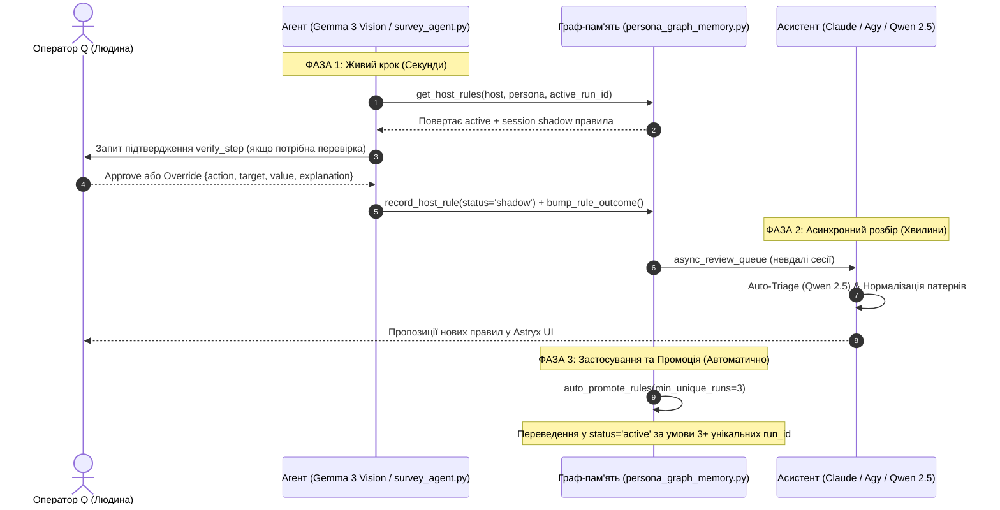

# Звіт про існуючу методику навчання агента (Agent Teaching Methodology Audit)

> **Документ:** `docs/reports/agent-teaching-methodology-audit.md`  
> **Дата:** 11 серпня 2026 року  
> **Статус:** Версія 2.0 (Актуалізовано після реалізації N≥3 автопромоції, Async-HITL та Synapse Memory OS)  
> **Авторитетний контекст:** [`docs/teaching-methodology.md`](file:///data/data/com.termux/files/home/vydra-swiss-survey/docs/teaching-methodology.md), [`docs/codebase-audit-implementation-plan.md`](file:///data/data/com.termux/files/home/vydra-swiss-survey/docs/codebase-audit-implementation-plan.md)

---

## 1. Загальний огляд та Проблема, яку вирішує методика

У попередніх версіях системи `vydra-swiss-survey` спостерігалася проблема "розімкнутої петлі" (open loop): ручні корекції оператора записувалися у таблицю `host_rules`, проте ніколи не потрапляли назад у промпт агента `survey_agent.py`, оскільки відсутній був зв'язок підтвердження результатів (`wins`/`losses`) та регулярний процес промоції правил.

Поточна методика навчання описує **чотирифазний закріплений цикл (closed-loop learning)**, у якому кожен крок опитування, кожен оверрайд оператора та кожна невдала сесія стають валідованим знанням агента.

---

## 2. Три учасники та три темпи (Three Actors & Three Timings)

Процес навчання розділено між трьома суб'єктами з чітким розмежуванням затримки (latency) та обов'язків:

| Упасник | Рівень затримки | Ключова роль у навчанні |
| :--- | :--- | :--- |
| **Агент (Gemma 3 Vision)** | **Секунди** (внутрішнє вікно 300с) | Пропонує дію на сторінці опитування, виконує CDP-кліки, фіксує трейс і результати прогону. |
| **Оператор Q (Людина)** | **Синхронно в сесії** / **Асинхронно в UI** | Приймає рішення в моменті (Approve/Override), задає гейти хостів, затверджує запропоновані нормалізовані правила. |
| **Асистент (Claude / Agy / Qwen 2.5)** | **Хвилини** (поза гарячим шляхом) | Аналізує невдалі сесії з `async_review_queue`, здійснює Auto-Triage, нормалізує вільний текст у словникові патерни, виявляє конфлікти правил. |

---

## 3. Чотири фази навчального циклу

### 🟢 Фаза 0 — Підготовка та Карта Покриття (Пре-прогін)
- Побудова карти покриття правила для target-хоста: що хост уже вміє (`active`), що знаходиться на випробувальному терміні (`shadow`), що конфліктує або ретировано (`retired`).
- Встановлення режиму хоста в `host_gates` (`off`, `shadow`, `active`).

### 🟡 Фаза 1 — Живий крок та Сесійний Override (Синхронний крок)
- Агент аналізує сторінку через `vision.decide_action` та запитує `get_host_rules()`.
- Корекція оператора через `override_step_api` записується зі статусом `status='shadow'` та еврістикою `"run_id": task_id` у `evidence`.
- **Санітаризація позиційних евристик:** Перевіряється `POSITIONAL_RE` (`item30`, `every-3rd`). Якщо прапорець `confirm_positional: false`, запит відхиляється (HTTP 422).
- **Session-Aware Live Override:** Завдяки передачі `active_run_id` у `get_host_rules()`, нове `shadow`-правило діє **негайно у цій же сесії**, не чекаючи промоції.

### 🔵 Фаза 2 — Асинхронний розбір та Тріаж (Async-HITL)
- Усі сесії з `outcome != 'completed'` автоматично додаються в `async_review_queue`.
- Фоновий воркер `auto_triage_pending_queue()` з використанням `TRIAGE_LLM_BASE_URL` (Qwen 2.5) класифікує помилки за 4 категоріями:
  1. `text_normalization_mismatch`
  2. `dom_structure_change`
  3. `navigation_timeout`
  4. `unclassified`
- Оператор в Astryx UI Console на вкладці Async Triage переглядає класифіковані помилки та затверджує створені правила.

### 🟣 Фаза 3 — Підкріплення та Автопромоція за N ≥ 3 унікальними `run_id`
- Усі застосування правил фіксуються у таблиці `rule_applications(rule_id, run_id, outcome, applied_at)`.
- Функція `auto_promote_rules(min_unique_runs=3)` здійснює автопромоцію rule у статус `active` **виключно при виконанні умов**:
  1. `status == 'shadow'`;
  2. `wins >= 3`;
  3. `wins > (losses * 2)`;
  4. Кількість унікальних `run_id` у `rule_applications` зі статусом `completed` $\ge 3$.
- Ранню промоцію після 1-win з `bump_rule_outcome()` повністю вилучено.

---

## 4. Схема даних та таблиці пам'яті (`persona_graph_memory.py`)

1. **`host_rules`**: Зберігає всі правила скрінінгу.
   - Поля: `id`, `host`, `persona`, `pattern`, `behavior`, `confidence`, `status` (`shadow`, `active`, `retired`), `wins`, `losses`, `evidence`, `provider_id`.
2. **`rule_applications`**: Журнал унікальних застосувань правил.
   - Поля: `rule_id`, `run_id`, `outcome`, `applied_at`, `UNIQUE(rule_id, run_id)`.
   - Забезпечує захист від фальшивої промоції при багаторазовому спрацьовуванні правила всередині однієї сесії.
3. **`async_review_queue`**: Черга невдалих сесій для Async-HITL.
   - Поля: `id`, `run_id`, `host`, `persona`, `outcome`, `reason`, `triage_category`, `status`, `created_at`, `reviewed_at`, `reviewer_note`.
4. **`app_settings`**: Зберігає конфігурації та метрики інтеграції (зокрема `synapse_last_sync_ts`, `synapse_sync_failures`).

---

## 5. Поточний стан реалізації в кодовій базі

| Компонент / Метод | Файл реалізації | Стан готовності |
| :--- | :--- | :--- |
| **Проєктна Конституція `.specify/constitution.md`** | [`.specify/constitution.md`](file:///data/data/com.termux/files/home/vydra-swiss-survey/.specify/constitution.md) | ✅ 100% Створено та привязано до коду (`commit c7bdf2d`, 12 серпня 2026) |
| **Скрипт SDD-перевірки `bin/sdd_verify.sh`** | [`bin/sdd_verify.sh`](file:///data/data/com.termux/files/home/vydra-swiss-survey/bin/sdd_verify.sh) | ✅ 100% Реалізовано, перевіряє всі 14 specs (Exit 0) |
| **Примусовий Git pre-commit хук** | [`.git/hooks/pre-commit`](file:///data/data/com.termux/files/home/vydra-swiss-survey/.git/hooks/pre-commit) | ✅ 100% Встановлено, блокує коміти при порушенні SDD |
| **Параметризований каскад пріоритетів `get_host_rules`** | [`persona_graph_memory.py`](file:///data/data/com.termux/files/home/vydra-swiss-survey/persona_graph_memory.py#L480) | ✅ 100% Реалізовано та параметризовано |
| **Журнал унікальних прогонів `rule_applications`** | [`persona_graph_memory.py`](file:///data/data/com.termux/files/home/vydra-swiss-survey/persona_graph_memory.py#L550) | ✅ 100% Реалізовано |
| **Сувора автопромоція `auto_promote_rules(3)`** | [`persona_graph_memory.py`](file:///data/data/com.termux/files/home/vydra-swiss-survey/persona_graph_memory.py#L595) | ✅ 100% Реалізовано |
| **Захист позиційних евристик `POSITIONAL_RE`** | [`astryx_survey_server.py`](file:///data/data/com.termux/files/home/vydra-swiss-survey/astryx_survey_server.py#L810) | ✅ 100% Реалізовано (HTTP 422) |
| **Воркер Auto-Triage Qwen 2.5** | [`persona_graph_memory.py`](file:///data/data/com.termux/files/home/vydra-swiss-survey/persona_graph_memory.py#L1820) | ✅ 100% Реалізовано |
| **REST API Async Queue (`/api/rules/async_queue`)** | [`rules_api.py`](file:///data/data/com.termux/files/home/vydra-swiss-survey/rules_api.py#L240) | ✅ 100% Реалізовано |
| **Синхронізація Synapse Memory OS (`synapse_adapter.py`)** | [`synapse_adapter.py`](file:///data/data/com.termux/files/home/vydra-swiss-survey/synapse_adapter.py) | ✅ 100% Реалізовано (non-blocking, <= 500ms timeout) |
| **UI Бейдж підтверджень `confirmed_runs`** | [`web/src/screens/rules/RulesTable.tsx`](file:///data/data/com.termux/files/home/vydra-swiss-survey/web/src/screens/rules/RulesTable.tsx) | ✅ 100% Реалізовано |
