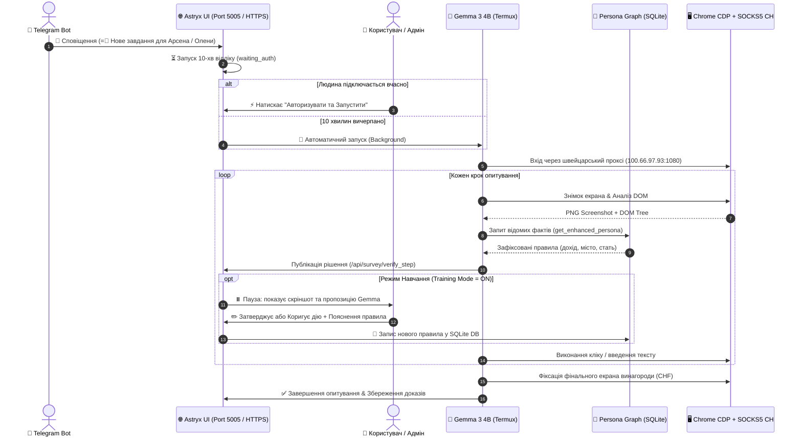
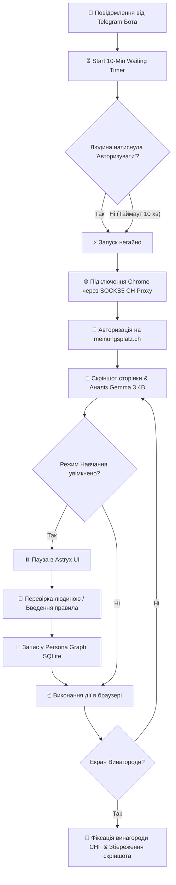

# Інструкція з навчання та роботи Swiss Survey Agent (vydra-swiss-survey)

> [!NOTE]
> Ця інструкція описує повний алгоритм роботи системи автоматичного та напів-автоматичного проходження опитувань на сайті **meinungsplatz.ch** з використанням проксі у Швейцарії, інтеграції Telegram-бота, штучного інтелекту Gemma 3 4B та Human-in-the-Loop панелі Astryx.

---

## 📐 Графічна схема архітектури та обміну даними

---

## 🔄 Покроковий алгоритм роботи системи

---

## 🛠️ Основні компоненти та доступи

> [!IMPORTANT]
> - **Astryx Web UI (Захищений HTTPS потік)**: [`https://kindle.exodus.pp.ua/survey`](https://kindle.exodus.pp.ua/survey)
> - **Локальний порт Astryx**: `http://192.168.3.196:5005`
> - **Chrome CDP порт (AGY2)**: `http://192.168.3.184:9226`
> - **Швейцарський SOCKS5 Проксі**: `100.66.97.93:1080`
> - **Telegram Бот**: `@...` (Токен: `8090499262:AAEQkYpCcWX...`)

---

## 📖 Як навчати агента в режимі Human-in-the-Loop:

1. **Перевірка режиму навчання:**
   Впевнитись, що в шапці Astryx UI увімкнено прапорець **"🎓 Режим Навчання"**.
2. **Отримання тригера:**
   При надходженні сповіщення від бота таймер починає відлік 10 хвилин.
3. **Авторизація:**
   Натиснути **"⚡ Авторизувати та Запустити негайно"** або дочекатися автоматичного старту.
4. **Перевірка дій:**
   На кожному кроці панель покаже скріншот та пропозицію Gemma:
   - Якщо Gemma відповіла правильно: натисніть **"✅ Затвердити рішення Gemma"**.
   - Якщо Gemma помилилась: введіть точну назву кнопки у поле виправлення, напишіть коротке пояснення правила (напр. *Для теми доходу вибирати вилку 60k-80k*) та натисніть **"🎓 Навчити Агента"**.
5. **Автоматичне збереження:**
   Усі нові правила миттєво зберігаються у базовий граф пам'яті (`~/.vydra-survey-profiles/survey_graph.db`) і будуть використовуватись агентом у майбутніх сесіях.
