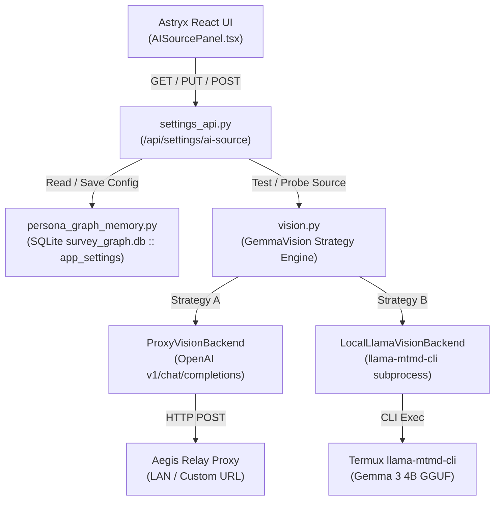
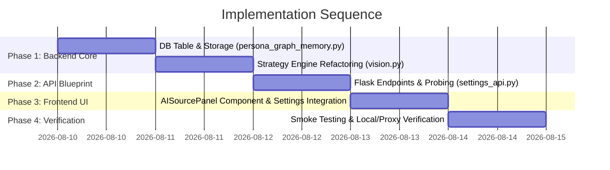

# Technical Plan: Dynamic AI / Vision Model Source Selector

> **Status:** Proposal / Draft for Owner Review  
> **Target Repository:** `~/projects/vydra-swiss-survey` (`master` @ commit `3d3e780`)  
> **Scope:** Replace hardcoded vision backend configuration in `vision.py` with a dynamic settings UI, source verification engine, vision-capable slot auto-probing, and restored local Gemma Termux support.

---

## 1. Executive Summary & Context

Currently, `vision.py` routes vision requests exclusively to an external proxy server ("Aegis Relay" on LAN dev-184) using hardcoded module defaults (`AEGIS_PROXY_URL = "http://192.168.3.184:18880"`, `AEGIS_PROXY_VISION_MODEL = "multimedia-proxy"`, `AEGIS_PROXY_TOKEN = "freecc"`). The local Termux `llama-mtmd-cli` vision path (Gemma 3 4B) was originally introduced in commit `7fdd446` but replaced in commit `85cdf30`.

This plan details the additive changes required to:
1. Provide a dedicated settings UI (**"AI Model Source"**) where users can switch between **Proxy URL** and **Local Termux Gemma**.
2. Persist configurations cleanly in SQLite (`survey_graph.db` via `persona_graph_memory.py`).
3. Offer a **"Test Source"** verification action that sends a real 1x1 test image payload to confirm end-to-end vision capability.
4. Auto-probe available model slots from the source to identify and filter slots that specifically support **image/vision input**.
5. Restore the local Gemma Termux execution path as a selectable backend strategy alongside the proxy adapter.

---

## 2. Domain Naming & Collision Avoidance

> [!CAUTION]
> **Naming Conflict Warning:** The existing settings panel `ProvidersPanel.tsx` (`/api/settings/providers`, `persona_graph_memory.list_providers()`) manages **Swiss survey panel vendors** (e.g. Meinungsplatz, Qualtrics, etc.). It is completely unrelated to LLM / AI providers.

To prevent architectural and UI confusion:
- **UI Tab Title:** `AI Model Source` (or `Vision Source`).
- **Frontend Component:** `AISourcePanel.tsx` in `web/src/screens/settings/`.
- **Backend API Blueprint:** `/api/settings/ai-source` in `settings_api.py`.
- **DB Table Name:** `app_settings` (generic key-value) or `ai_source_config`.

---

## 3. Architecture & Backend Design



### 3.1 Database Persistence (`persona_graph_memory.py`)

A new key-value table `app_settings` will be added to the SQLite `SCHEMA` in `persona_graph_memory.py`:

```sql
CREATE TABLE IF NOT EXISTS app_settings (
    key TEXT PRIMARY KEY,
    value TEXT NOT NULL,
    updated_at TEXT NOT NULL
);
```

#### Helper Functions to Add:
- `get_app_setting(key: str, default: str | None = None) -> str | None`
- `set_app_setting(key: str, value: str) -> None`
- `get_ai_source_config() -> dict`: Reads stored configuration with fallback to environment variables (`AEGIS_PROXY_URL`, `AEGIS_PROXY_VISION_MODEL`, `AEGIS_PROXY_TOKEN`).
- `save_ai_source_config(config: dict) -> None`: Validates and persists configuration JSON under key `"ai_source_config"`.

#### Data Schema (`ai_source_config` JSON):
```json
{
  "active_source": "proxy",
  "proxy": {
    "base_url": "http://192.168.3.184:18880",
    "model": "multimedia-proxy",
    "token": "freecc",
    "timeout_seconds": 120
  },
  "local": {
    "cli_path": "~/llama.cpp/build/bin/llama-mtmd-cli",
    "model_path": "~/models/gemma3-4b/gemma-3-4b-it-Q4_K_M.gguf",
    "mmproj_path": "~/models/gemma3-4b/mmproj-model-f16.gguf",
    "use_gpu": false,
    "threads": 8,
    "context_size": 4096,
    "timeout_seconds": 1200
  }
}
```

---

### 3.2 Vision Engine Refactoring (`vision.py`)

`vision.py` will be refactored into a **Strategy Pattern** while retaining full backward compatibility for callers (`GemmaVision.decide_action()` and `GemmaVision.run_vision()` signatures remain unchanged).

#### Class Structure:
1. `BaseVisionBackend` (Abstract base interface):
   - `run_vision(image_path: str, prompt: str, timeout: int) -> str`
2. `ProxyVisionBackend(BaseVisionBackend)`:
   - Encapsulates HTTP client calls to OpenAI-compatible `v1/chat/completions` endpoint.
   - Handles base64 data URL formatting (`data:image/png;base64,...`).
   - Handles Bearer auth header injection server-side.
3. `LocalLlamaVisionBackend(BaseVisionBackend)`:
   - Restores local Termux CLI invocation logic from commit `7fdd446`.
   - Executes `subprocess.run` with `[cli_path, "-m", model_path, "--mmproj", mmproj_path, "--image", image_path, "-p", prompt, ...]`.
   - Supports OpenCL GPU offload (`-ngl 99` + `_GPU_ENV_EXTRA` library paths) with auto-downgrade to CPU (`-t 8`) on crash or timeout.
4. `GemmaVision`:
   - High-level adapter instantiated by `survey_agent.py`.
   - Reads active config dynamically from `persona_graph_memory.get_ai_source_config()`.
   - Dispatches `run_vision()` calls to the configured backend strategy (`ProxyVisionBackend` or `LocalLlamaVisionBackend`).

---

### 3.3 Backend API Blueprint (`settings_api.py`)

A new Flask Blueprint `settings_bp` will be registered in `astryx_survey_server.py`:

```python
from settings_api import settings_bp
app.register_blueprint(settings_bp)
```

#### Endpoints Specification:

| Method | Endpoint | Description |
| :--- | :--- | :--- |
| **GET** | `/api/settings/ai-source` | Returns active AI source config. (Auth tokens masked as `"fr***cc"` for UI presentation). |
| **PUT** | `/api/settings/ai-source` | Updates and saves active AI source config. Validates required fields. |
| **POST** | `/api/settings/ai-source/test` | Executes an empirical test vision call against the supplied or stored configuration using a 1x1 test image. |
| **POST** | `/api/settings/ai-source/probe-models` | Probes the source's `/v1/models` endpoint and tests vision capability of each model slot. |

---

## 4. Verification Engine ("Test This Source")

The **"Test Source"** action validates that the chosen source can successfully process image inputs end-to-end, rather than merely responding to a basic network ping.

### 4.1 Test Request Details

1. **Test Payload Image:** A 1x1 pixel transparent PNG base64 string:
   `data:image/png;base64,iVBORw0KGgoAAAANSU5EUgAAAAEAAAABCAYAAAAfFcSJAAAADUlEQVR42mNk+M9QDwADhgGAWjR9awAAAABJRU5ErkJggg==`
2. **Prompt:** `"Reply with the exact word: OK"`
3. **Execution Path:**
   - **Proxy:** Sends HTTP `POST` to `{base_url}/v1/chat/completions` with image content block and `max_tokens: 16`.
   - **Local:** Writes test PNG to a temporary file (`/tmp/vydra_vision_test.png`) and executes `llama-mtmd-cli`.
4. **Validation Logic:**
   - Verifies HTTP 200 response (or returncode 0 for CLI).
   - Verifies response contains non-empty text content.
   - Measures round-trip execution latency (`latency_ms`).
5. **Return Shape:**
   ```json
   {
     "status": "success",
     "latency_ms": 412,
     "raw_output": "OK",
     "source_type": "proxy",
     "model_used": "multimedia-proxy"
   }
   ```
   *If verification fails:*
   ```json
   {
     "status": "error",
     "latency_ms": 1250,
     "error": "Aegis proxy returned 500: Model 'text-only-v1' does not accept image input.",
     "source_type": "proxy"
   }
   ```

---

## 5. Vision-Slot Auto-Probe Logic

When targeting a proxy service, multiple model slots may be exposed (e.g. `text-davinci-003`, `multimedia-proxy`, `claude-3-5-sonnet`, `llama-3-8b`). The system must identify which slots support **vision/image input**.

### 5.1 Enumerate & Empirical Test Strategy

1. **Model Enumeration:**
   - Fetch `GET {base_url}/v1/models` using the configured Bearer token.
   - Extract model IDs from response JSON `data[].id`.
2. **Vision Capability Empirical Probe:**
   - Model naming heuristics (e.g. checking if name contains `"vision"`, `"multimedia"`, `"claude-3"`, `"gpt-4o"`, `"gemma-3"`) can provide an initial priority ranking, but **empirical verification is required** because model names behind custom proxies do not always reflect capabilities.
   - For each candidate model slot, issue a lightweight 1x1 test image call with prompt `"Describe in 1 word"` (`max_tokens: 5`, `timeout: 10`).
   - If the endpoint accepts the multimodal message payload without returning an error (such as `400 Bad Request: image_url not supported` or `422 Unprocessable Entity`), the slot is marked `vision_capable: true`.
3. **Probe Results Payload:**
   ```json
   {
     "total_discovered": 4,
     "vision_capable_count": 2,
     "models": [
       { "id": "multimedia-proxy", "vision_capable": true, "latency_ms": 380, "error": null },
       { "id": "claude-3-5-sonnet", "vision_capable": true, "latency_ms": 820, "error": null },
       { "id": "text-llama-3-70b", "vision_capable": false, "latency_ms": 110, "error": "Model does not support image_url input" }
     ],
     "recommended_slot": "multimedia-proxy"
   }
   ```

### 5.2 Evaluation of Options (a) vs (b)

- **Option (a): Probe, filter, and surface list in UI dropdown for user selection.**
  - *Pros:* Complete user transparency; allows user to pick alternative vision slots if primary proxy slot has high latency.
  - *Cons:* Requires one extra user click to select model.
- **Option (b): Auto-select first vision-capable slot automatically.**
  - *Pros:* Fully automated zero-click setup.
  - *Cons:* May pick an suboptimal model slot if proxy exposes multiple vision models.

#### Recommendation: Hybrid Approach (Option A + Auto-Select Shortcut)
Surface the filtered list of confirmed vision-capable slots in a UI dropdown (`<Select>`), and provide an **"Auto-Detect & Select Best"** button that probes models and selects the fastest vision-capable slot in a single step.

---

## 6. Local Termux Gemma Restoration Plan

To restore the dormant local Gemma Termux path:

1. **Pre-flight Dependency Check:**
   - Verify binary existence: `os.path.exists(os.path.expanduser(cli_path))` (`~/llama.cpp/build/bin/llama-mtmd-cli`).
   - Verify GGUF model files: `gemma-3-4b-it-Q4_K_M.gguf` and `mmproj-model-f16.gguf`.
2. **Environment & Shared Library Mapping:**
   - Include OpenCL driver library paths in `LD_LIBRARY_PATH` when `use_gpu=True` (`/system/lib64`, `/vendor/lib64`, `$PREFIX/opt/vendor/lib`).
3. **GPU Crash Guard / CPU Fallback:**
   - Maintain the automatic GPU downgrade state inside `LocalLlamaVisionBackend`. If OpenCL fails (non-zero exit or timeout), flag `gpu_disabled = True` for the remaining session lifecycle and fallback to CPU threads (`-t 8`).

---

## 7. Frontend UI Design (`AISourcePanel.tsx`)

A new panel component `AISourcePanel.tsx` will be created in `web/src/screens/settings/`.

### 7.1 Component Layout & Astryx Components

```
+-----------------------------------------------------------------------+
|  [Card] AI Model Source Configuration                                 |
|  Configure the vision model provider used for survey interaction.      |
|-----------------------------------------------------------------------|
|  Source Selection:                                                    |
|  (o) Proxy Service (LAN / Remote)      ( ) Local Termux Gemma         |
|-----------------------------------------------------------------------|
|  [IF PROXY SELECTED]                                                  |
|  Proxy Base URL:                                                      |
|  [TextField: http://192.168.3.184:18880                           ]   |
|  API Token:                                                           |
|  [TextField (password): **********                                ]   |
|  Model Slot / Name:                                                   |
|  [Select: multimedia-proxy ▾]  [Button: Probe Vision Slots 🔍]        |
|-----------------------------------------------------------------------|
|  [IF LOCAL SELECTED]                                                  |
|  llama-mtmd-cli Path:                                                 |
|  [TextField: ~/llama.cpp/build/bin/llama-mtmd-cli                 ]   |
|  Model GGUF Path:                                                     |
|  [TextField: ~/models/gemma3-4b/gemma-3-4b-it-Q4_K_M.gguf          ]   |
|  MMPROJ Path:                                                         |
|  [TextField: ~/models/gemma3-4b/mmproj-model-f16.gguf             ]   |
|  [Checkbox] Enable OpenCL GPU Offload (-ngl 99)                       |
|-----------------------------------------------------------------------|
|  Actions:                                                             |
|  [Button (Primary): Save Configuration]                               |
|  [Button (Secondary): Test Source 🧪]                                 |
|-----------------------------------------------------------------------|
|  [Alert / Status Banner]                                              |
|  Status: Verified (Latency: 380ms) | Model: multimedia-proxy           |
+-----------------------------------------------------------------------+
```

### 7.2 Astryx Design System Compliance
- Uses standard Astryx primitives: `Card`, `Surface`, `Button`, `TextField`, `Select`, `Badge`, `Alert`, `Toast`, `Spinner`.
- Integrates into the main Settings screen navigation alongside `HostsPanel.tsx`, `PatternsPanel.tsx`, `PersonasPanel.tsx`, `ProvidersPanel.tsx`.
- Matches existing dialog/alert patterns (`AlertDialog` for confirmation, `useToast` for action feedback).

---

## 8. Phased Implementation Roadmap



### Phase Details:
- **Phase 1 (Backend Core & Persistence):**
  - Add `app_settings` schema and accessor functions in `persona_graph_memory.py`.
  - Refactor `vision.py` into strategy backends (`ProxyVisionBackend`, `LocalLlamaVisionBackend`).
  - Unit test strategy instantiation and dynamic config loading.
- **Phase 2 (API Blueprint):**
  - Create `settings_api.py` with routes `/api/settings/ai-source`, `/test`, and `/probe-models`.
  - Register blueprint in `astryx_survey_server.py`.
- **Phase 3 (Frontend Component):**
  - Build `web/src/screens/settings/AISourcePanel.tsx`.
  - Wire state handling, form validation, probing dropdown, test trigger, and toast notifications.
  - Add "AI Model Source" tab to Settings screen.
- **Phase 4 (Verification & Smoke Testing):**
  - Perform real vision calls against Aegis Relay proxy and local Termux CLI.
  - Verify zero impact on existing in-flight UI files (`RuleDetail.tsx`, `TraceDetail.tsx`, etc.).

---

## 9. Constraints, Security & Risk Analysis

### 9.1 Security & Secret Protection
- **Token Masking:** Auth tokens are saved in backend SQLite (`survey_graph.db`). GET `/api/settings/ai-source` returns a masked token string (`"fr***cc"`).
- **No Client Secrets:** Frontend JS never hardcodes or exposes raw proxy credentials. Authorization headers are injected server-side by `ProxyVisionBackend`.

### 9.2 Risks & Mitigation Strategies

| Risk | Impact | Mitigation Strategy |
| :--- | :--- | :--- |
| **Termux RAM Exhaustion** | High (Process killed by Android OS) | Keep local Gemma process execution strictly bounded by CPU/GPU locks; ensure only one heavy process runs at a time. |
| **Proxy Endpoint Timeout** | Medium (UI hangs during test/probe) | Enforce strict timeouts (15s for verification test, 10s per probed model slot). |
| **Naming Collision with Providers** | High (Developer/User confusion) | Explicitly use `ai-source` / `AISourcePanel` everywhere; never overload `providers`. |
| **In-Flight UI Conflict** | Medium (Git merge conflicts) | All UI edits are additive (new file `AISourcePanel.tsx` + single tab entry point in Settings). |

---

## 10. Open Questions for Owner Sign-Off

1. **Proxy Token Handling:** Is standard token masking (`"fr***cc"`) on GET requests preferred, or should tokens be omitted entirely unless explicitly updated by the user?
2. **Local Model Default Paths:** Are the paths `~/llama.cpp/build/bin/llama-mtmd-cli` and `~/models/gemma3-4b/gemma-3-4b-it-Q4_K_M.gguf` still canonical on all target Termux environments?
3. **Auto-Probe Concurrency:** When probing proxy model slots, should probing execute sequentially (safer for proxy load) or in parallel with a concurrency limit of 3?
