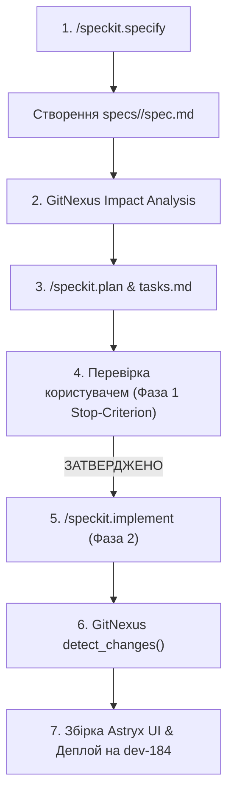

# План міграції проєкту `vydra-swiss-survey` на Spec-Driven Development (SDD)

> **Специфікація:** `specs/001-sdd-migration`  
> **Статус:** Драфт для узгодження (Фаза 1)  
> **Дата:** 11 серпня 2026 року  
> **Автор:** Autonomous Agent Agy

---

## 1. Мета та огляд проєкту

Метою цієї міграції є переведення процесу розробки та підтримки системи `vydra-swiss-survey` на **Spec-Driven Development (SDD)** за допомогою GitHub Spec Kit (`specify-cli` v0.16.2) у зв'язці з графічним графом залежностей **GitNexus**.

Це забезпечить:
1. Строгий формалізований контроль змін до створення коду.
2. Автоматичний аналіз зони ураження (Blast Radius Analysis) перед модифікацією будь-яких системних функцій.
3. Повну гарантію збереження зворотної сумісності з поточним алгоритмом виконання `survey_agent.py` та SQLite БД.

---

## 2. Модульна архітектура та межі специфікації

Кодова база проєкту розділяється на 4 ключові специфікаційні домени:

| Домен / Специфікація | Модулі / Файли | Основна відповідальність |
| :--- | :--- | :--- |
| **`specs/002-rules-api`** | `rules_api.py`, `rules_report.py` | REST API для управління правилами, генерація звітів конфліктів, розрахунок `confirmed_runs`. |
| **`specs/003-async-review-queue`** | `persona_graph_memory.py`, `survey_agent.py` | Авто-заповнення черги невдалих сесій, Qwen 2.5 auto-triage воркер, N≥3 автопромоція. |
| **`specs/004-astryx-ui-console`** | `web/src/screens/ops/SurveyOps.tsx`, `RulesTable.tsx`, `PatternsPanel.tsx` | React 19 SPA у консолі Astryx, інтерфейс Async-HITL, санітаризація позиційних евристик. |
| **`specs/005-cdp-vision-agent`** | `survey_agent.py`, `cdp_client.py`, `vision.py` | Автономний цикл виконання опитувань, Gemma 3 Vision, CDP socket lifecycle. |

---

## 3. SDD Workflow для розробника та агента Agy

Для кожної майбутньої задачі застосовується наступний чіткий розробницький цикл:

### Команди CLI `specify-cli`:
* `specify init` — Ініціалізація структури `.specify/` та створення Конституції.
* `specify new <feature-name>` — Створення нового шаблону специфікації.
* `specify check` — Перевірка цілісності специфікацій та зв'язку з задачами.

---

## 4. Аналіз залежностей та Blast Radius (за даними GitNexus)

За допомогою GitNexus проаналізовано точки входу кодової бази та визначено зони високого ризику:

1. **`persona_graph_memory._connect()` (High Risk):**
   - **Upstream callers:** `survey_agent.py`, `astryx_survey_server.py`, `rules_api.py`, `rules_report.py`, `reflection.py`.
   - **Інваріант:** Будь-які зміни в `_connect()` зобов'язані зберігати WAL-режим (`PRAGMA journal_mode=WAL`) та `busy_timeout=5000`.
2. **`persona_graph_memory.bump_rule_outcome()` (Medium Risk):**
   - **Upstream callers:** `survey_agent.py:356`, `astryx_survey_server.py`.
   - **Інваріант:** Не має виконувати миттєву промоцію у `active`, а викликати `auto_promote_rules(3)`.
3. **`astryx_survey_server.override_step_api()` (Medium Risk):**
   - **Upstream callers:** Astryx UI Console (`SurveyOps.tsx`).
   - **Інваріант:** Вимагає `confirm_positional: true` для `item30`/`every-3rd` і зберігає `run_id` у `evidence` для моментальної дії в сесії.

---

## 5. Гарантія зворотної сумісності

* **База даних:** Всі нові таблиці (`rule_applications`, `async_review_queue`) та поля (`provider_id`, `confirmed_runs`) є чисто адитивними.
* **CDP Таймаути:** Жодні зміни в SDD не впливають на логіку перепідключення WebSocket у `cdp_client.py`.
* **API Контракти:** Старі ендпоінти `/api/rules`, `/api/survey/verify_step` зберігають свою структуру відповідей, розширюючись лише необов'язковими додатковими полями.
