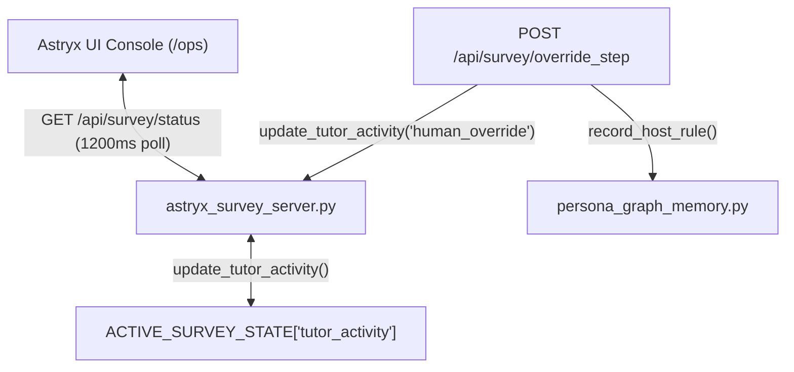

# Feature Architecture Plan: Tutor Live Activity Card

**Feature Name:** `005-tutor-live-activity`  
**Status:** Approved / Specification Aligned  
**Created:** 2026-08-11  

---

## 1. Architectural Boundaries & Data Flow

---

## 2. Component Impacts

1. **`astryx_survey_server.py`:**
   - Add `tutor_activity` state dictionary under `ACTIVE_SURVEY_STATE`.
   - Implement thread-safe `update_tutor_activity()` helper under `STATE_LOCK`.
   - Update `override_step_api` and `push_task_from_text` to populate activity state.

2. **`web/src/screens/ops/SurveyOps.tsx`:**
   - Add TypeScript interface `TutorActivity`.
   - Extend `SurveyStatus` interface.
   - Render styled Astryx Design System `<Card>` with badges and promotion indicators.

3. **`tests/integration/test_tutor_activity_sdd.py`:**
   - End-to-end integration test validating payload consistency and state updates.
