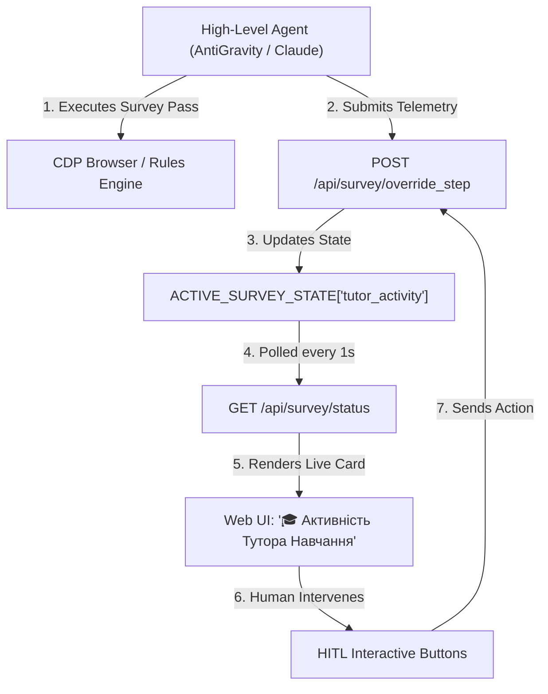

# Architecture Plan: Feature 006 — Tutor Interactive Loop & High-Level Agent Integration

## 1. Architecture Overview

## 2. Component Touchpoints
1. **Teaching Skill:**
   - Update `.agents/skills/speckit-teaching/SKILL.md` and `.claude/skills/speckit-teaching/SKILL.md` to define exact rules for high-level agents to read/write `tutor_activity` telemetry.
2. **Backend Engine (`astryx_survey_server.py`):**
   - Ensure `update_tutor_activity()` helper processes `decision_source`, `matched_pattern`, `chosen_behavior`, and `promotion_count`.
3. **Web UI (`web/src/screens/ops/SurveyOps.tsx`):**
   - Enhance the **"🎓 Активність Тутора Навчання"** visual card with interactive decision buttons:
     - **"✅ Підтвердити як активне правило"**
     - **"✏️ Змінити дію (Override)"**
     - **"⏭️ Передати тутору"**
4. **Integration Test (`tests/integration/test_tutor_interactive_loop.py`):**
   - Verify agent telemetry updates and human interactive override flow end-to-end.
