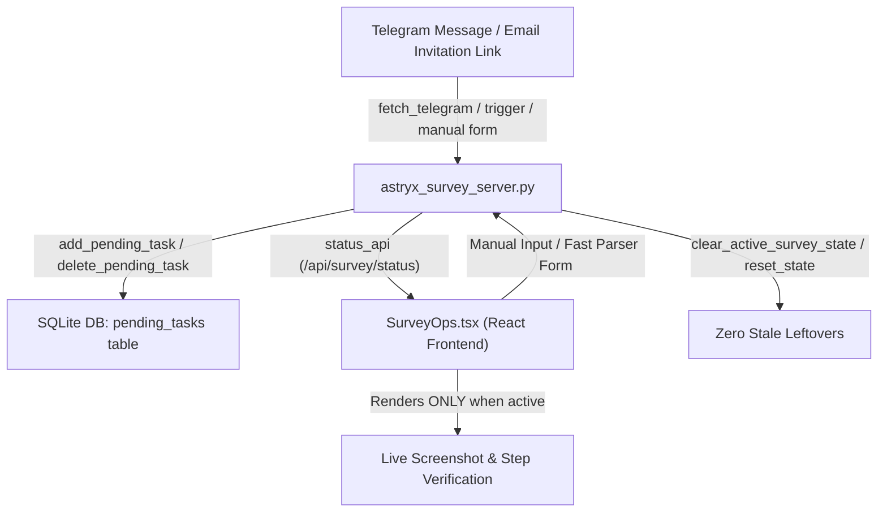

# Implementation Plan: 017-survey-workflow-state-cleanup-and-task-persistence

## Architecture Overview

## Proposed Changes

1. **`persona_graph_memory.py`**:
   - Add table `pending_tasks` to `SCHEMA`.
   - Implement `add_pending_task`, `get_pending_tasks`, `delete_pending_task`, `update_pending_task_status`, `clear_pending_tasks`.
   - Add alias `save_setting = set_setting`.

2. **`astryx_survey_server.py`**:
   - Initialize `PENDING_TASKS` from `persona_graph_memory.get_pending_tasks()` on startup.
   - Sync task changes (creation, selection, deletion) with `persona_graph_memory`.
   - Implement `clear_active_survey_state()` and route `POST /api/survey/reset_state`.
   - Fix `telegram_listener_thread` to use `persona_graph_memory.set_setting` and catch/log all exceptions without halting.
   - Add `Cache-Control: no-cache, no-store, must-revalidate` for `index.html` delivery in `serve_app`.

3. **`web/src/screens/ops/SurveyOps.tsx`**:
   - Add "➕ Запуск опитування вручну / з пошти" form card with quick-parse text option.
   - Add "🧹 Скинути стан" button calling `/api/survey/reset_state`.
   - Conditionally render "Живий скріншот & Текст кроку", "Панель навчання", and "Правила" ONLY when survey is active/waiting verification.
   - Show clean idle standby card when no survey is running.

4. **Tests & Build**:
   - `tests/unit/test_pending_tasks_persistence.py`
   - `tests/integration/test_survey_state_cleanup.py`
   - `npm run build` in `web/`
